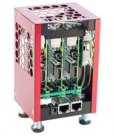

#  WiFiNATify

## Convert the MiniPiRack to use WiFi for WAN and a NAT internally

The MiniPiRack ships with each processor board configured to use an external DHCP server via a hard-wired ethernet cable.  However, it's not always easy to pull a network cable to where the MiniPiRack is located.  Usually in those environments, there's readily-accessible wifi.  Luckily, the processor boards (Raspberry Pis) have both an ethernet and a wifi network interface.

This ansible script configures the MiniPiRack to use the wifi network interface as the gateway to the network and exposes a DHCP server and NAT service to the other processor boards.

See [network diagram.
](./images/MiniPiRack-NAT.png)

The internal network (p2-r1, p3-r1) can be access via p1-r1 as a jump server.

# HOWTO Setup the Wifi and NAT
1. Connect via wired connection so the ansible script can be run.
2. Run the ansible script to configure the MiniPiRack.
3. Disconnect the ethernet cable while the rack reboots.  You won't need it anymore.
4. Depending on your network setup, you might be able to connect using:

       ssh pirate@p1-r1.local
5. If p1-r1.local does not resolve to an IP address, use the Bluetooth pairing to attach to the master p1-r1 (see directions below.)
6. Get the IP address of the p1-r1 wlan0 network adapter using 'ifconfig'
7. ssh to p1-r1 by:

       ssh pirate@<ip address of p1-r1 wlan0>
9. Enjoy your newly Wifi-connected, NAT-ed MiniPiRack!

## To run the ansible playbook

    ansible-playbook -i hosts site.yml --extra-vars "ssid=<wifi network name> wifipassword=<wifi password name> btname=<paired Bluetooth name>"

ssid - the SSID of the WiFi network to connect to
wifipassword - the password of the WiFi network
The 'btname' variable is optional.  Without it, the btname will default to 'rpi1'.

## To access a terminal via BlueTooth using 'screen'

The ansible script will expose the master (p1-r1) via Bluetooth so that you can connect to it via iTerm2 or other terminal program.

### HOWTO Connect via Bluetooth
1. Using Bluetooth, pair your laptop to the MiniPiRack master (p1-r1) ([Bluetooth pairing
](./images/BluetoothPairing.png))
2. Connect using 'screen' to p1-r1 (See directions below.)

### Find the Bluetooth device
*This will not work until you have paired your laptop with p1-r1 (Step #4 in the HOWTO).*

At a shell prompt:

    ls -al /dev/cu*

You should see something like the following

    /dev/cu.p1-r1-SerialPort

The name of the connected device is 'p1-r1'

### Connect via Bluetooth using 'screen'
The command to start a tty session is:
screen /dev/cu.<name of connected device goes here\>-SerialPort 115200

For the device listed above (p1-r1):

    screen /dev/cu.p1-r1-SerialPort 115200

Credit for showing how to expose a terminal via Bluetooth goes to [Patrick Hundal](https://hacks.mozilla.org/author/phundalmozilla-com/) for the HOWTO at https://hacks.mozilla.org/2017/02/headless-raspberry-pi-configuration-over-bluetooth/

[MiniPiRack.com](https://www.minipirack.com) - a scalable, desktop cluster

