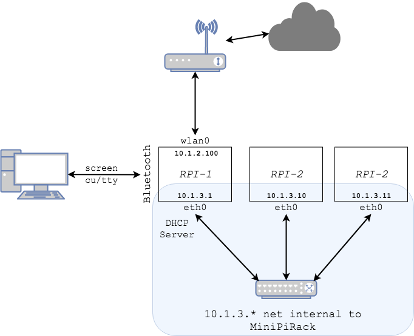

# wifinatify

## Convert the MiniPiRack to use WiFi for WAN and a NAT internally

The MiniPiRack ships with each processor board configured to use an external DHCP server via a hard-wired ethernet cable.  However, it's not always easy to pull a network cable to where the MiniPiRack is located.  Usually in those environments, there's readily-accessible wifi.  Luckily, the processor boards (Raspberry Pis) have both an ethernet and a wifi network interface.

This ansible script configures the MiniPiRack to use the wifi network interface as the gateway to the network and exposes a DHCP server and NAT service to the other processor boards.

See [network diagram.
](./images/MiniPiRack-NAT.png)

The internal network (r1-p2, r1-p3) can be access via r1-p1 as a jump server.

# HOWTO
1. Connect via wired connection so the ansible script can be run
2. Run the ansible script to configure the MiniPiRack
3. Disconnect the ethernet cable.  You won't need it anymore.
4. Using Bluetooth, pair your laptop to the MiniPiRack master (r1-p1) ([Bluetooth pairing
](./images/BluetoothPairing.png)
5. Connect using 'screen' to r1-p1 (See directions below.)
6. Edit /etc/networks/interfaces.d/wlan0 to set the network name (wpa-ssid) and password (wpa-psk)
7. Run 'sudo systemctl restart networking'
8. Run 'ifconfig' to get the new ip address for the wlan0 interface.
9. Or, depending on your network configuration, you might be able to 'ssh pirate@r1-p1.local'
10. Enjoy your newly Wifi-connected, NAT-ed MiniPiRack!

## To run the ansible playbook

ansible-playbook -i hosts site.yml

## To access a terminal via BlueTooth using 'screen'

### Find the Bluetooth device
*This will not work until you have paired your laptop with r1-p1 (Step #4 in the HOWTO).*

At a shell prompt:

    ls -al /dev/cu*

You should see something like the following

    /dev/cu.r1-p1-SerialPort

The name of the connected device is 'r1-p1'

### Connect using 'screen'
The command to start a tty session is:
screen /dev/cu.<name of connected device goes here\>-SerialPort 115200

For the device listed above (r1-p1):

    screen /dev/cu.r1-p1-SerialPort 115200

Credit goes to [Patrick Hundal](https://hacks.mozilla.org/author/phundalmozilla-com/) for the HOWTO at https://hacks.mozilla.org/2017/02/headless-raspberry-pi-configuration-over-bluetooth/ for showing how to expose a terminal via Bluetooth.

